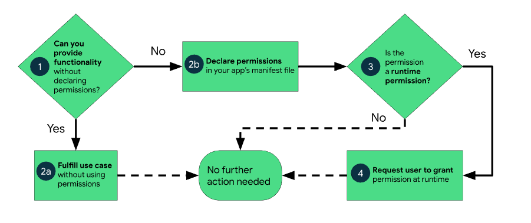
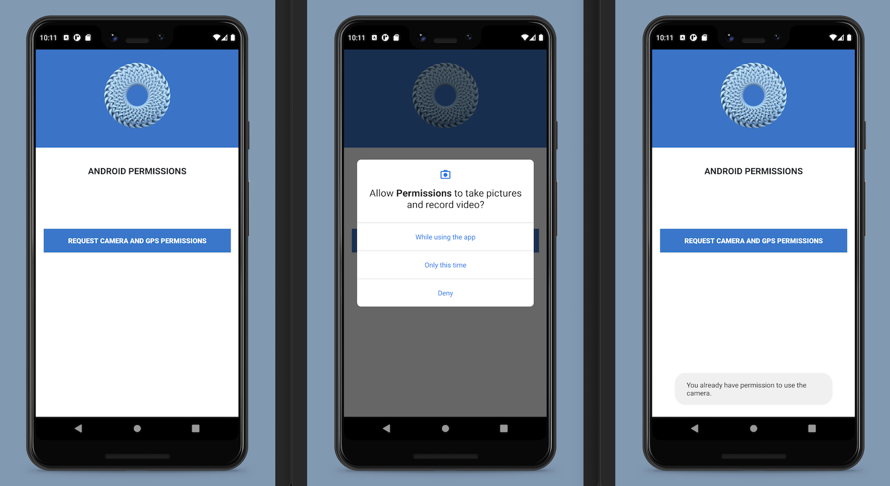

# Android Permissions

## About The Project

This is a simple Kotlin project that is used to better understand how App permissions work within Android, using both the camera and GPS permissions.

Permission i requested for the camera and the GPS functionality, by using a Button together with a click listener within a ConstraintLayout.

App permissions help support user privacy by protecting access to the following:

- **Restricted data**, such as system state and a user's contact information.
- **Restricted actions**, such as connecting to a paired device and recording audio.

This project looks at runtime permissions that require a request for permission to be made at runtime.

The [Google Permissions Developer Docs](https://developer.android.com/guide/topics/permissions/overview) indicate the following workflow for app permissions:

## App Screenshots

## Built With

* [Kotlin: 1.5.10](https://kotlinlang.org/)
* [Android Studio: 4.2](https://developer.android.com/studio)
* [Android Lollipop: (5.0)](https://www.android.com/intl/en_uk/versions/lollipop-5-0/)
* [Android 5.0: (API level 21)](https://developer.android.com/about/versions/lollipop)

## Prerequisites

* [Kotlin: 1.5.10](https://kotlinlang.org/)
* [Android Studio: 4.2](https://developer.android.com/studio)
* [Android Lollipop: (5.0)](https://www.android.com/intl/en_uk/versions/lollipop-5-0/)
* [Android 5.0: (API level 21)](https://developer.android.com/about/versions/lollipop)

## License

Distributed under the MIT License. See `LICENSE` for more information.

## Contact

- [Email](mailto:aymerjames@gmail.com)
- [Linkedin](https://uk.linkedin.com/in/jamesaymer)
- [Github](https://github.com/JaymoAymer)

## Acknowledgements
* [Android Developer Documentation: Permissions on Android](https://developer.android.com/guide/topics/permissions/overview)